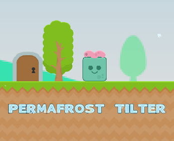

Permafrost Tilter  
================   
  

You play as a little blue square that was living happily with his pet worm when one day,  the worm disappears! You thus set out to find him, and realize that an eternal has started. Luckily you have the power to turn your internal body heat into fire, you can now use that to save the world and destroy the ice blobs! But watch out not to get too cold or you might not make it to your worm!  

Permafrost Tilter is a small platformer based on avoiding the cold and trying to stay warm. There are 8 main levels where you can go through the main story and 3 bonus levels where you can have fun trying out the different game mechanics.  

**************
# Installation  
This repo contains the source code of the game with no project files. To compile it yourself, please create a gradle or idea project using the provided source. Otherwise, you can directly play the game by following the instructions below.

# Playing the game  
If you're only interested in playing the game, Permafrost_tilter.zip contains an executable named `PermafrostTilter.jar`. Once unzipped, please excecute the `.jar` file from the same folder (in the same directory as the `res` folder).  
You must have a java version >= 1.8 to be able to run the game.  

# Guide  
A small guide has been written and was added under README.pdf. It contains a small description of the game mechanics and controls as well as the layouts of each level.  

# Development 
Note that the source code was last updated in March of 2017 and contains a non-finished version of a procedural level at the end. If you feel like working on the project, I highly recommend using Java 8 to avoid having any compatibility issues. 
